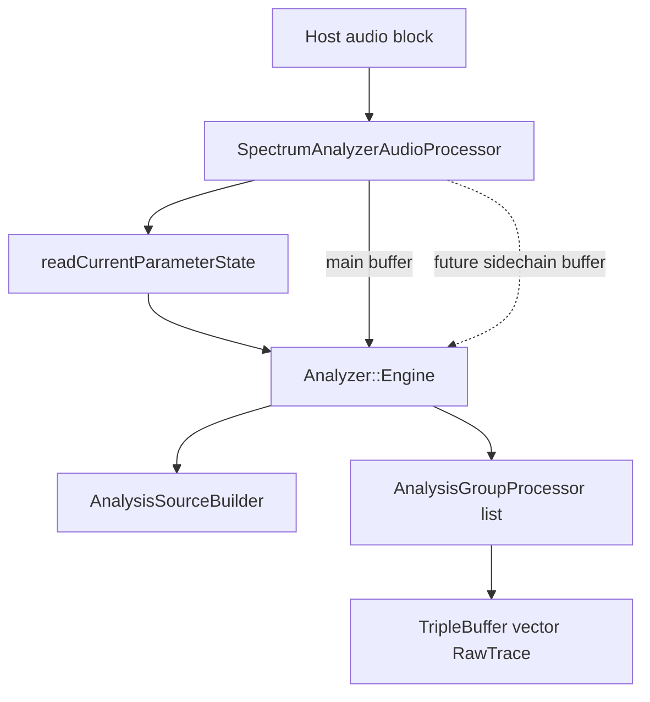
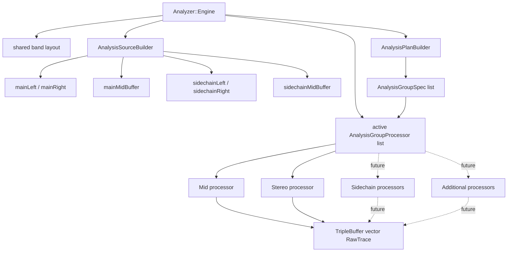
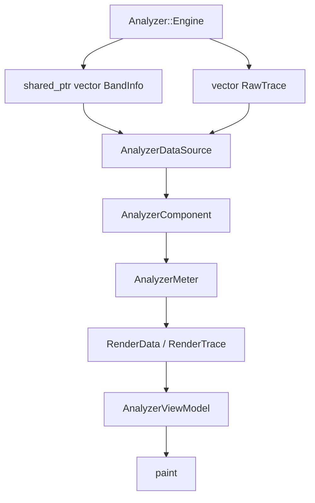
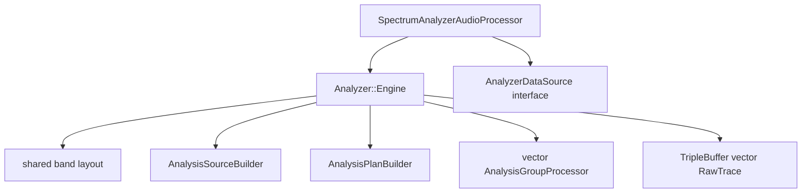
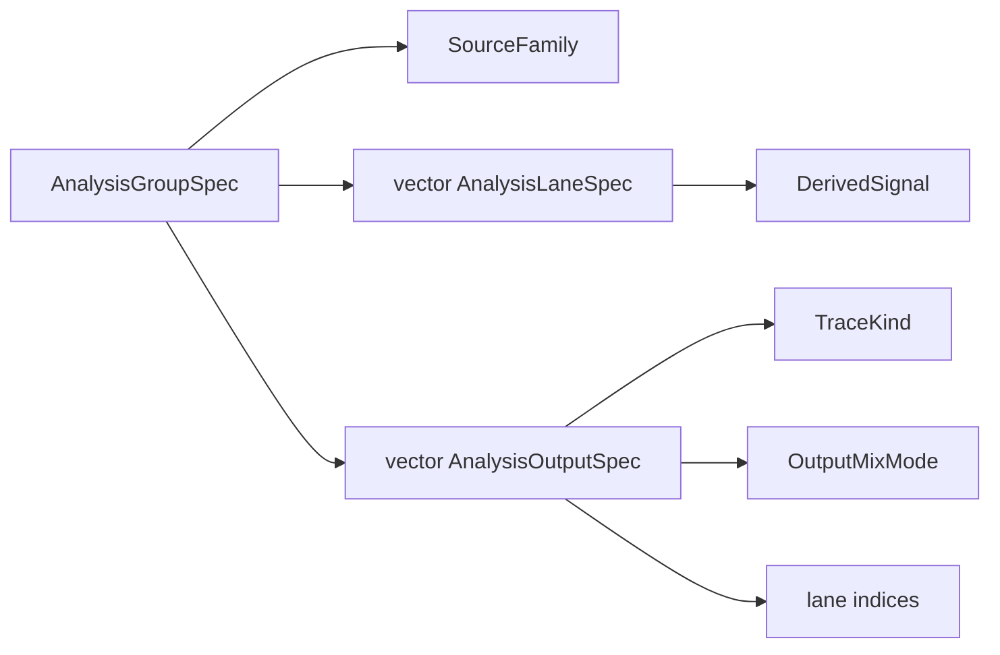
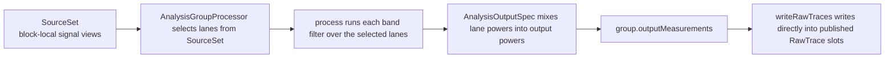
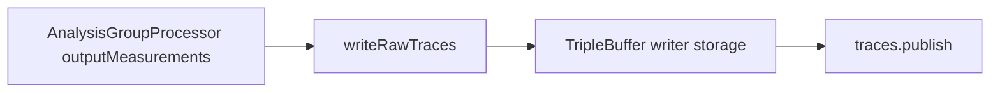

# Audio Processing Architecture

This document describes the current audio-processing/backend architecture from `SpectrumAnalyzerAudioProcessor` down into the analyzer DSP engine and back up into the UI-facing analyzer data flow.

## 1. Audio Callback Flow



## 2. Engine Internals



## 3. UI Data Flow



## 4. Processor And Engine Types



## 5. Engine Internals As A Tree

```text
SpectrumAnalyzerAudioProcessor
└── Analyzer::Engine
    ├── shared_ptr<vector<BandInfo>> bandInfo
    ├── AnalysisSourceBuilder sourceBuilder
    │   ├── SourceSet
    │   │   ├── mainLeft / mainRight
    │   │   ├── mainMid
    │   │   ├── sidechainLeft / sidechainRight
    │   │   └── sidechainMid
    │   └── engine-owned derived buffers
    │       ├── mainMidBuffer
    │       └── sidechainMidBuffer
    ├── AnalysisPlanBuilder planBuilder
    ├── vector<AnalysisGroupProcessor> processors
    │   └── each AnalysisGroupProcessor owns:
    │       ├── AnalysisGroupSpec
    │       │   ├── SourceFamily
    │       │   ├── vector<AnalysisLaneSpec>
    │       │   └── vector<AnalysisOutputSpec>
    │       ├── vector<BandState>
    │       ├── vector<vector<BandMeasurements>> outputMeasurements
    │       └── reused process scratch
    ├── size_t publishedTraceCount
    └── TripleBuffer<vector<RawTrace>> traces
```

## 6. Analysis Group Spec Model



## 7. SourceSet To AnalysisGroupProcessor To RawTrace



Plainly:

- `SourceSet` says where the samples for this block live.
- `AnalysisGroupProcessor` says which of those signals to read, how many lanes to process, and how outputs are mixed.
- `RawTrace` is the published per-band result after that processing is done.

Example:

- In `mid` mode, `SourceSet.mainMid` feeds one processor lane, and that processor publishes one `RawTrace`.
- In `stereo` mode, `SourceSet.mainLeft` and `SourceSet.mainRight` feed two lanes in one processor, and that processor still publishes one collapsed `RawTrace`.

## 8. Publish Path



- The engine no longer builds a temporary `traceScratch` vector per block.
- Each processor writes its outputs directly into pre-sized triple-buffer writer storage.
- This keeps the modular split without paying for an extra full-copy trace-materialization layer.

## Current State

- `mid` is implemented as one `AnalysisGroupProcessor` with one `mid` lane and one published `input` trace.
- `stereo` is implemented as one `AnalysisGroupProcessor` with `left` and `right` lanes and one published `input` trace mixed with `OutputMixMode::averagePower`.
- `side` is implemented as one `AnalysisGroupProcessor` with one `side` lane and one published `input` trace.
- Sidechain source plumbing exists, and sidechain-backed modes are available through the analysis mode selection.
- `SignalView` is just a lightweight pointer + length view.
  `left/right` point into host-owned buffers.
  `mainMidBuffer` / `sidechainMidBuffer` are engine-owned derived storage for this block.

## Guiding Rule

The engine owns derived per-block buffers and processor state.
The host owns the incoming `AudioBuffer`.
`SourceSet` is only a set of views that tells each active `AnalysisGroupProcessor` where to read its signal from for the current block.
