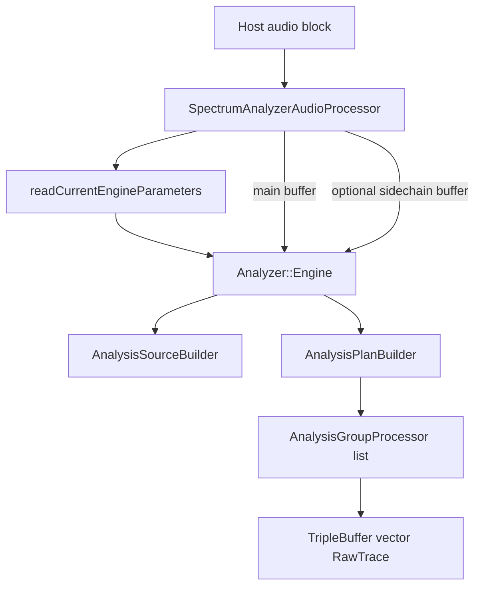
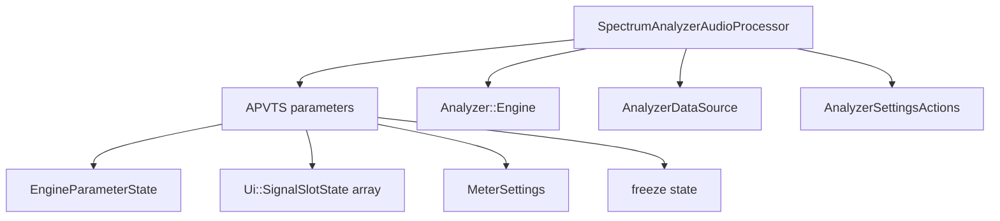
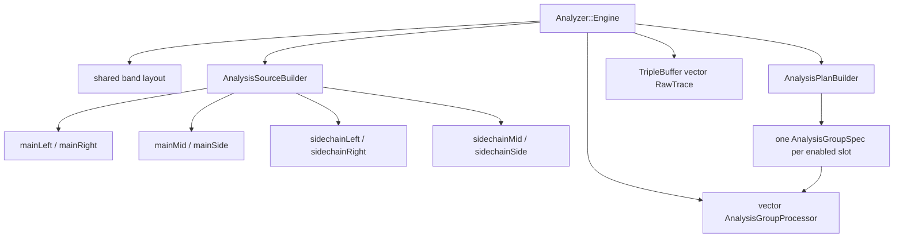
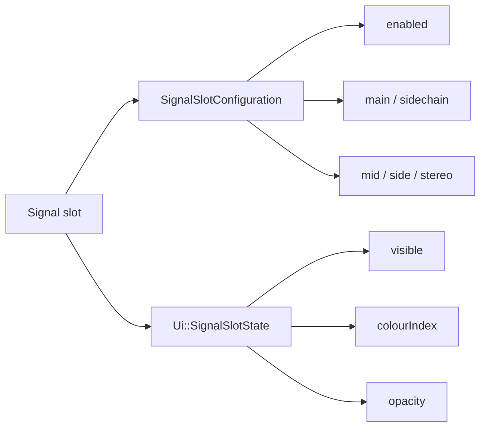
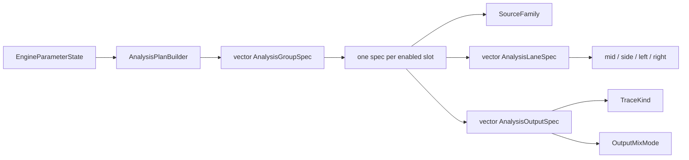
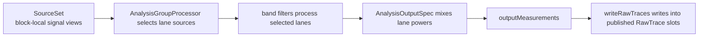
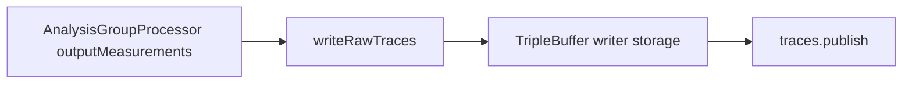
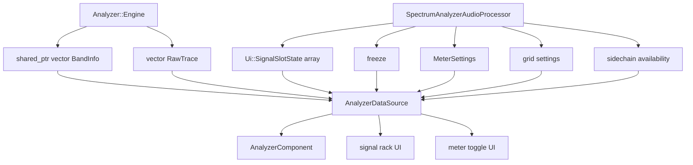

# Audio Processing Architecture

This document describes the current backend and analyzer data flow from `SpectrumAnalyzerAudioProcessor` down into the analyzer DSP engine and back up into the UI.

## 1. Audio Callback Flow



## 2. Processor Responsibilities



- The processor reads only `EngineParameterState` on the audio thread.
- The UI reads slot presentation state, freeze state, grid settings, and meter settings through `AnalyzerDataSource`.
- The processor also exposes UI write actions through `AnalyzerSettingsActions`.
- APVTS state plus persistent UI-only slot order are serialized in `getStateInformation()` / `setStateInformation()`.

## 3. Engine Internals



## 4. Engine Internals As A Tree

```text
SpectrumAnalyzerAudioProcessor
└── Analyzer::Engine
    ├── shared_ptr<vector<BandInfo>> bandInfo
    ├── AnalysisSourceBuilder sourceBuilder
    │   ├── SourceSet
    │   │   ├── mainLeft / mainRight
    │   │   ├── mainMid / mainSide
    │   │   └── sidechainLeft / sidechainRight / sidechainMid / sidechainSide
    │   └── engine-owned derived buffers
    │       ├── mainMidBuffer / mainSideBuffer
    │       └── sidechainMidBuffer / sidechainSideBuffer
    ├── AnalysisPlanBuilder planBuilder
    ├── vector<AnalysisGroupProcessor> processors
    │   └── each AnalysisGroupProcessor owns:
    │       ├── AnalysisGroupSpec
    │       │   ├── SourceFamily
    │       │   ├── vector<AnalysisLaneSpec>
    │       │   └── vector<AnalysisOutputSpec>
    │       ├── vector<BandState>
    │       ├── vector<vector<BandMeasurements>> outputMeasurements
    │       └── reused process scratch
    ├── size_t publishedTraceCount
    └── TripleBuffer<vector<RawTrace>> traces
```

## 5. Slot-Based Signal Model



- The engine uses `SignalSlotConfiguration` only.
- The UI uses `Ui::SignalSlotState`, which wraps slot configuration plus presentation data.
- Up to `4` slots are supported through `Shared::maxSignalSlots`.
- Each enabled slot becomes one published trace identity: `TraceKind::slot1` through `TraceKind::slot4`.

## 6. Analysis Plan Model



Current planning rules:

- `Mid`
  - one lane: `DerivedSignal::mid`
  - one output: `OutputMixMode::singleLane`
- `Side`
  - one lane: `DerivedSignal::side`
  - one output: `OutputMixMode::singleLane`
- `Stereo`
  - two lanes: `DerivedSignal::left`, `DerivedSignal::right`
  - one output: `OutputMixMode::averagePower`

## 7. SourceSet To AnalysisGroupProcessor To RawTrace



Plainly:

- `SourceSet` says where the samples for this block live.
- `AnalysisGroupProcessor` reads one `AnalysisGroupSpec` and processes the requested lanes.
- `RawTrace` is the published per-band result for one slot trace.

Examples:

- In `mid` mode, `mainMid` or `sidechainMid` feeds one lane and produces one slot trace.
- In `side` mode, `mainSide` or `sidechainSide` feeds one lane and produces one slot trace.
- In `stereo` mode, `left` and `right` feed two lanes and produce one slot trace by averaged power.

## 8. Publish Path



- The engine writes processor outputs directly into pre-sized triple-buffer writer storage.
- There is no temporary per-block `traceScratch` vector in the publish path.

## 9. UI Data Flow



## 10. Current State

- The backend is slot-based, not single-mode based.
- `mid`, `side`, and `stereo` are implemented for both main input and sidechain input.
- Sidechain bus support is implemented in the processor and source builder.
- The analyzer UI supports up to `4` signal slots, each with:
  - enabled state
  - visibility
  - source
  - mode
  - color
  - opacity
- Global freeze exists as a UI-facing parameter/state.
- Meter visibility toggles (`Peak`, `RMS`, `Hold`) are UI-controlled existing parameters.

## Guiding Rule

The host owns the incoming `AudioBuffer`.
The engine owns derived per-block buffers and processor state.
`SourceSet` is only a set of lightweight views for the current block.
The processor bridges APVTS-backed settings into:

- engine-facing slot configuration for audio-thread processing
- UI-facing slot presentation and analyzer display state for the editor
