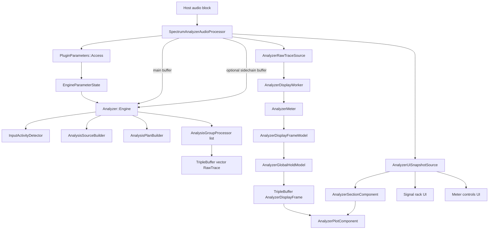
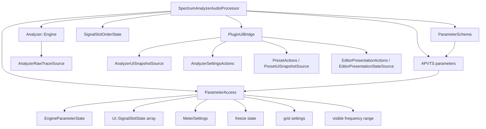
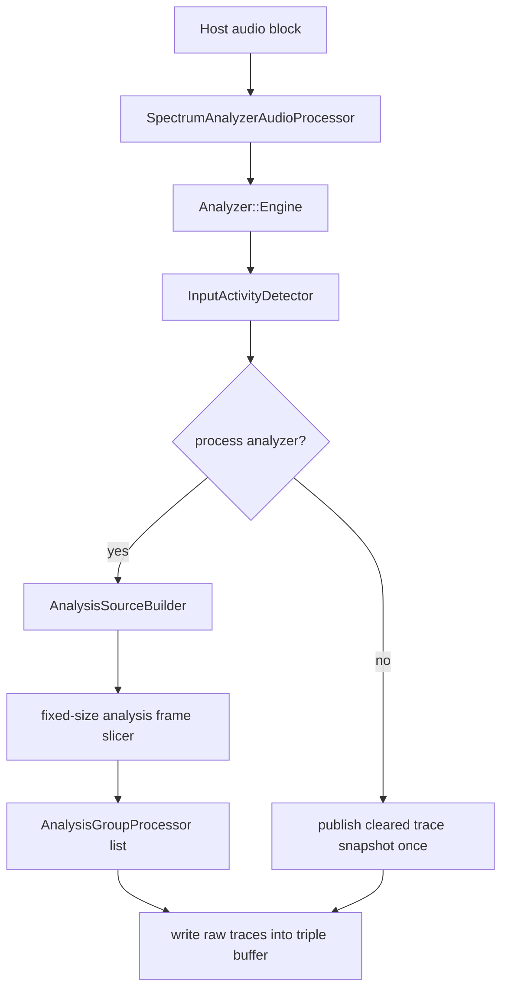
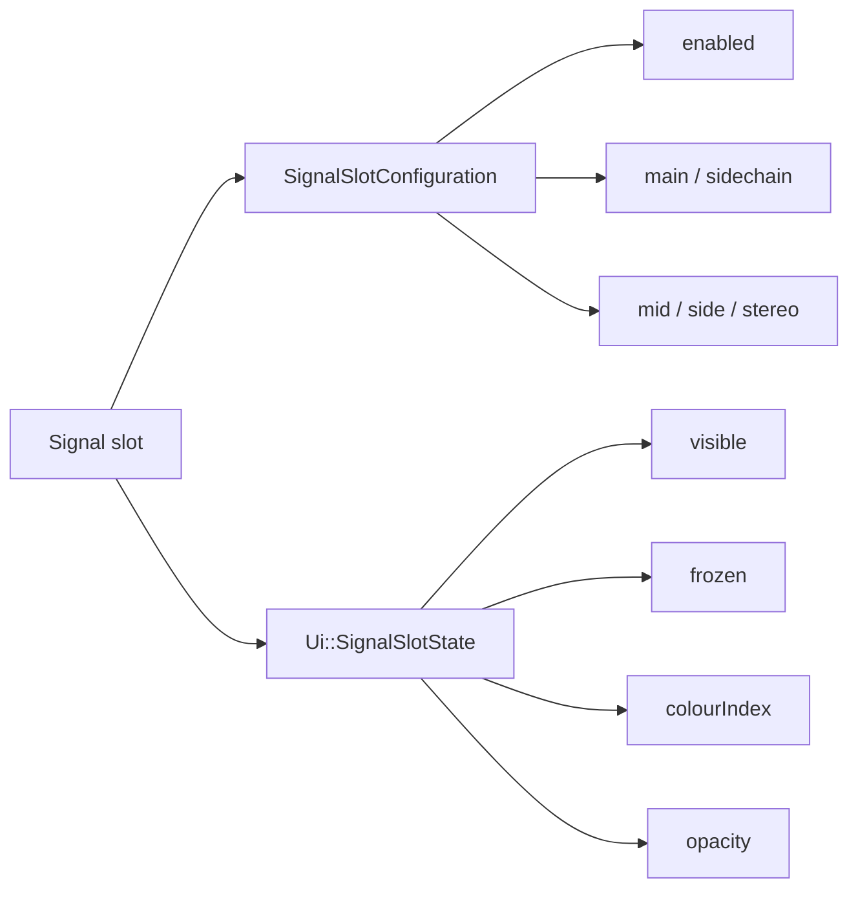
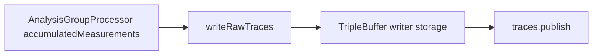
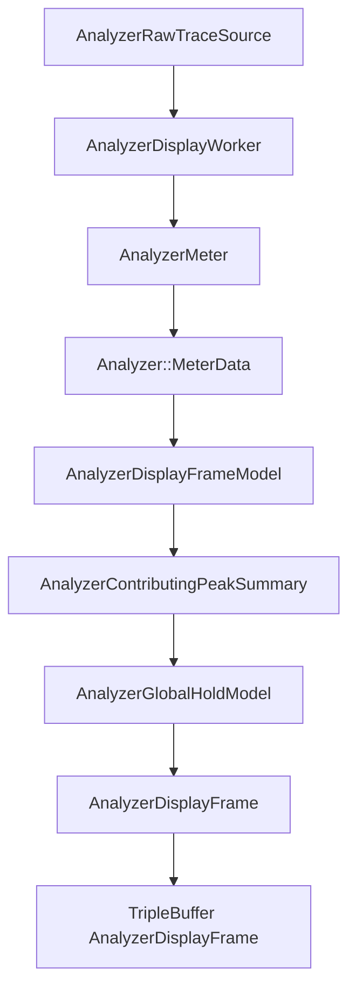
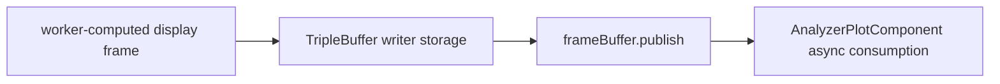

# Audio Processing Architecture

This document describes the current backend and analyzer data flow from `SpectrumAnalyzerAudioProcessor` into the analyzer DSP engine, through the display worker, and up into the UI.

## 1. End-To-End Flow



The important split is:

- DSP publishes raw analyzer measurements
- display worker turns them into semantic display state
- UI consumes immutable frames and paints them

## 2. Processor Responsibilities



`SpectrumAnalyzerAudioProcessor` is the composition root.

It owns:

- APVTS
- parameter schema and typed parameter access
- persistent slot order state
- analyzer engine and output mixer
- state serialization and preset session
- `PluginUiBridge` and the change tracker

`PluginUiBridge` implements every UI-facing contract (`AnalyzerSettingsActions`, `AnalyzerUiSnapshotSource`, `EditorPresentationActions`, `EditorPresentationStateSource`, `PresetActions`, `PresetUiSnapshotSource`). It owns snapshot listener lists, last-published dedup caches, and message-thread marshalling of refreshes. The processor must not implement UI contracts directly.

`Analyzer::Engine` implements `AnalyzerRawTraceSource` (owned by `src/dsp/core/`), which exposes:

- `getBandInfo()`
- `readPublishedTraces()`
- `hasRecentSignal()`
- `shouldProcessAnalyzer()`

`createEditor()` assembles a `Ui::EditorContext` pointing the raw trace channel at the engine and every other contract at the bridge.

The processor does not own the display worker. The worker is editor-side and is owned by `AnalyzerPlotComponent`.

## 3. DSP Engine Responsibilities

`Analyzer::Engine` remains audio-thread-only.

It owns:

- band layout generation
- input-activity detection
- source-view building
- analyzer plan building
- active analysis processors
- raw trace publication

It does not own:

- display-rate meter decay
- slot freeze latching
- hold state
- slot order
- colour or opacity

## 4. Engine Internals

```text
SpectrumAnalyzerAudioProcessor
└── Analyzer::Engine
    ├── shared_ptr<vector<BandInfo>> bandInfo
    ├── InputActivityDetector inputActivityDetector
    ├── AnalysisSourceBuilder sourceBuilder
    ├── AnalysisPlanBuilder planBuilder
    ├── vector<AnalysisGroupProcessor> processors
    ├── array<FrameSlotState, 2> frameSlots
    ├── size_t nextFrameSlotToStart
    ├── size_t samplesUntilNextFrameStart
    ├── size_t publishedTraceCount
    ├── TripleBuffer<vector<RawTrace>> traces
    ├── atomic<bool> recentSignalActive
    └── bool hasPublishedSilenceWhileInactive
```

## 5. Audio Callback Flow



Important behavior:

- the engine slices host blocks into fixed analyzer frames
- adjacent frames overlap by 50%
- publish cadence is independent from host block size
- silence publication happens once per inactive period

## 6. Slot-Based Signal Model



Rules:

- DSP consumes `SignalSlotConfiguration` only
- UI consumes `Ui::SignalSlotState`
- display worker consumes a reduced semantic state derived from UI state

## 7. DSP Publish Path



The DSP triple buffer now feeds the display worker, not the UI directly.

This path carries:

- `vector<RawTrace>`
- one writer: audio thread
- one reader: display worker

It does not carry:

- UI snapshots
- hold overlays
- paint-ready geometry

## 8. Display Worker Stage

This is the new middle layer between DSP and UI.



The worker owns:

- display-rate metering
- per-slot frozen-frame capture
- per-slot semantic frame publication
- contributing-peak reduction for hold semantics
- global hold timing and decay
- active vs idle wake cadence

Active ticks use monotonic 20 ms deadlines. Each deadline advances from the previous deadline,
not from the end of the last worker pass, so computation time does not slow the nominal 50 fps
cadence. If work overruns one or more deadlines, the worker skips them and resumes at the next
future deadline; it never publishes catch-up bursts. A control-state wake computes immediately
and reanchors the cadence. Settled displays poll at the slower idle interval, while global freeze
waits for an explicit control-state wake without polling. The active rate has one code-level
setting, `Display::Constants::framesPerSecond`, in
`display/analyzer/config/AnalyzerDisplayConstants.h`; the frame interval is derived from it.

The worker does not own:

- slot order
- colours
- opacity
- hover
- JUCE geometry

## 9. Display Control State

The worker consumes `AnalyzerDisplayControlState`, derived from `Ui::AnalyzerUiSnapshot`.

It contains:

- `meterSettings`
- `floorDb`
- `globalFrozen`
- `slotFrozen`
- `slotContributing`

`slotContributing` is intentionally semantic, not visual. It defines which slot frames participate in:

- hold ownership
- hold level reduction

That is what makes future solo support fit without redesigning the pipeline.

## 10. Display Publish Path



The display triple buffer carries:

- `AnalyzerDisplayFrame`
- one writer: display worker
- one reader: `AnalyzerPlotComponent` on the message thread

The display frame contains:

- shared `bandInfo`
- one slot-keyed frame per logical slot
- optional global hold frame
- revision counter

The frame is keyed by slot index, not by UI order.

## 11. Band Layout Ownership

Band layout remains DSP-owned.

`Analyzer::Engine` rebuilds `bandInfo` when:

- sample rate changes
- analyzer band mode changes

That `bandInfo` pointer is then:

- read by the display worker
- republished in `AnalyzerDisplayFrame`
- forwarded into `AnalyzerSectionComponent` so the shell can rebuild canonical layout when band geometry changes

This keeps one source of truth for frequency layout.

## 12. Current State

- backend is slot-based, not single-mode based
- `mid`, `side`, and `stereo` are implemented for main and sidechain sources
- sidechain bus support is implemented in processor and source builder
- DSP publishes raw traces only
- display worker owns meter, freeze, and hold semantics
- UI consumes immutable display frames and immutable UI snapshots
- global hold is no longer computed on the message thread
- raw trace transport and UI snapshot transport remain separate

## Guiding Rule

The host owns the incoming `AudioBuffer`.

The engine owns:

- derived per-block buffers
- filter-bank state
- raw measurements

The display layer owns:

- time-evolving display semantics

The UI owns:

- presentation only

The processor bridges APVTS-backed state into those layers, but should not become the home of analyzer business logic that belongs in `dsp`, `display`, or `ui`.
