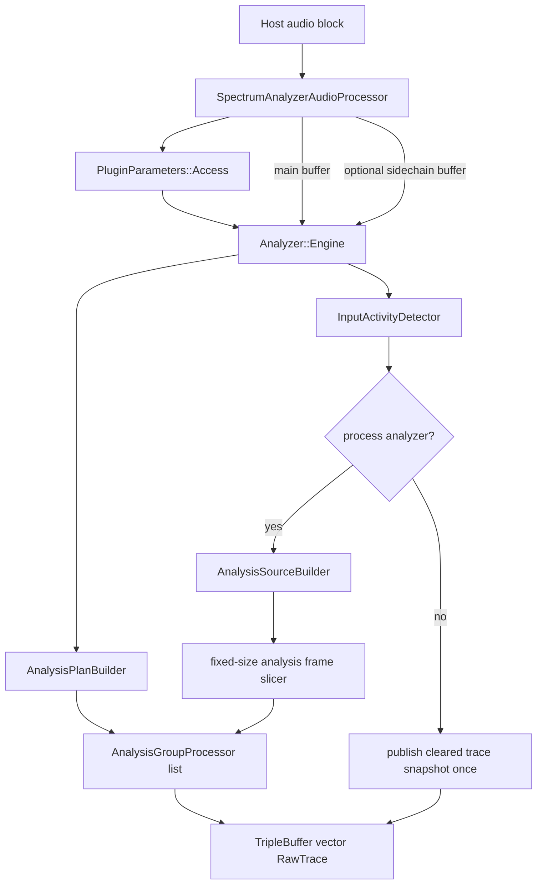
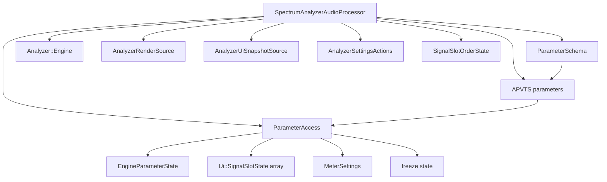
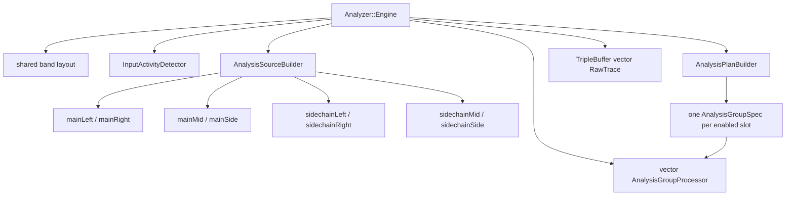
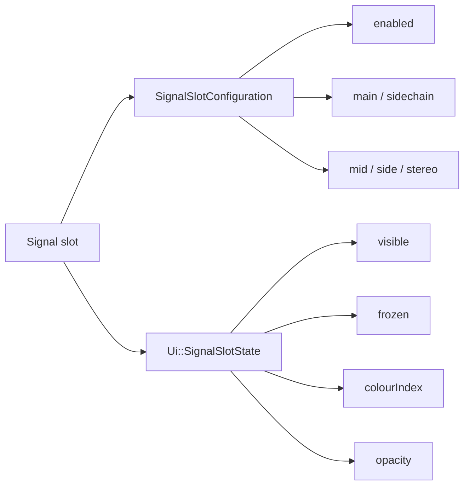
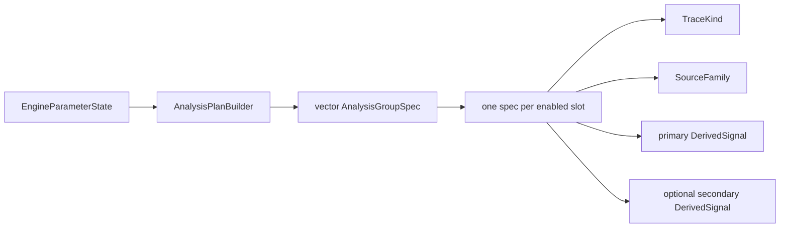
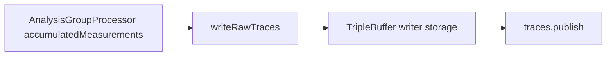
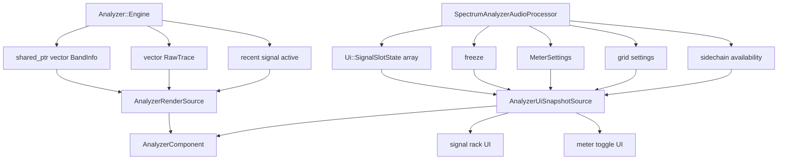

# Audio Processing Architecture

This document describes the current backend and analyzer data flow from `SpectrumAnalyzerAudioProcessor` down into the analyzer DSP engine and back up into the UI.

## 1. Audio Callback Flow



## 2. Processor Responsibilities



- `ParameterSchema` is the single source of truth for parameter ids, labels, choices, ranges, and APVTS layout construction.
- `ParameterAccess` caches APVTS parameter pointers and exposes typed reads/writes for engine state, UI slot state, and meter/grid state.
- The processor reads only `EngineParameterState` on the audio thread.
- The UI reads analyzer traces and band metadata through `AnalyzerRenderSource`.
- The UI reads slot presentation state, freeze state, grid settings, and meter settings through `AnalyzerUiSnapshotSource`.
- The processor also exposes UI write actions through `AnalyzerSettingsActions`, including semantic slot operations used by the rack UI.
- APVTS state plus persistent UI-only slot order are serialized in `getStateInformation()` / `setStateInformation()`.

## 3. Engine Internals



## 4. Engine Internals As A Tree

```text
SpectrumAnalyzerAudioProcessor
└── Analyzer::Engine
    ├── shared_ptr<vector<BandInfo>> bandInfo
    ├── InputActivityDetector inputActivityDetector
    ├── AnalysisSourceBuilder sourceBuilder
    │   ├── SourceSet
    │   │   ├── mainLeft / mainRight
    │   │   ├── mainMid / mainSide
    │   │   └── sidechainLeft / sidechainRight / sidechainMid / sidechainSide
    │   └── engine-owned derived buffers
    │       ├── mainMidBuffer / mainSideBuffer
    │       └── sidechainMidBuffer / sidechainSideBuffer
    ├── AnalysisPlanBuilder planBuilder
    ├── vector<AnalysisGroupProcessor> processors
    │   └── each AnalysisGroupProcessor owns:
    │       ├── AnalysisGroupSpec
    │       │   ├── TraceKind
    │       │   ├── SourceFamily
    │       │   ├── primary DerivedSignal
    │       │   └── optional secondary DerivedSignal
    │       ├── FilterBank
    │       │   ├── vector<SIMDBPFilter> primaryFilters
    │       │   ├── vector<SIMDBPFilter> secondaryFilters (stereo mode only)
    │       │   ├── vector<SIMDRegister<float>> sumPowers
    │       │   └── vector<SIMDRegister<float>> peakPowers
    │       ├── vector<BandMeasurements> outputMeasurements (slice scratch)
    │       ├── array<vector<BandMeasurements>, 2> accumulatedMeasurements (overlapping frame slots)
    │       └── no separate per-band filter objects
    ├── array<FrameSlotState, 2> frameSlots
    ├── size_t nextFrameSlotToStart
    ├── size_t samplesUntilNextFrameStart
    ├── size_t publishedTraceCount
    └── TripleBuffer<vector<RawTrace>> traces
```

## 5. Slot-Based Signal Model



- The engine uses `SignalSlotConfiguration` only.
- The UI uses `Ui::SignalSlotState`, which wraps slot configuration plus presentation data.
- Up to `4` slots are supported through `Shared::maxSignalSlots`.
- Each enabled slot becomes one published trace identity: `TraceKind::slot1` through `TraceKind::slot4`.

## 6. Analysis Plan Model



Current planning rules:

- `Mid`
  - primary signal: `DerivedSignal::mid`
  - no secondary signal
- `Side`
  - primary signal: `DerivedSignal::side`
  - no secondary signal
- `Stereo`
  - primary signal: `DerivedSignal::left`
  - secondary signal: `DerivedSignal::right`
  - output trace is averaged stereo power

## 7. SourceSet To AnalysisGroupProcessor To RawTrace

```mermaid
flowchart LR
    SourceSet[SourceSet\nblock-local signal views] --> Slice[Engine slices exact analysis-frame segments]
    Slice --> Select[AnalysisGroupProcessor selects lane sources]
    Select --> Filter[band filters process selected lane or lane pair]
    Filter --> Mix[optional stereo average]
    Mix --> SliceMeasurements[slice measurements]
    SliceMeasurements --> Accumulate[accumulate into active overlapping analysis frames]
    Accumulate --> RawTrace[writeRawTraces writes completed frame into published RawTrace slots]
```



Plainly:

- `SourceSet` says where the samples for this host block live.
- `AnalysisGroupProcessor` reads one `AnalysisGroupSpec` and drives one `FilterBank`.
- `FilterBank` packs as many adjacent logical bands as fit in the current compiled SIMD width so one broadcast input sample updates a whole SIMD group at once.
- The engine slices host blocks into exact fixed-size analyzer frames (`2048` samples currently) with a `1024`-sample hop, so publish cadence is independent from host block size and adjacent frames overlap by 50%.
- `RawTrace` is the published per-band result for one completed analysis frame of one slot trace.
- `InputActivityDetector` decides whether recent input energy still justifies running the analyzer DSP.
- If a configured source is unavailable, the processor clears that trace instead of reusing stale measurements.

Examples:

- In `mid` mode, `mainMid` or `sidechainMid` feeds one lane and produces one slot trace.
- In `side` mode, `mainSide` or `sidechainSide` feeds one lane and produces one slot trace.
- In `stereo` mode, `left` and `right` feed two lanes and produce one slot trace by averaged power.

## 8. Publish Path



- The engine writes completed fixed-size analysis frames directly into pre-sized triple-buffer writer storage.
- There is no temporary per-publish `traceScratch` vector in the publish path.
- When recent input falls below the activity threshold, the engine publishes one cleared snapshot and then skips analyzer processing until signal returns.

## 9. FilterBank Notes

- Coefficients are derived from the current `BandInfo` layout using cookbook band-pass equations.
- `BandInfo` is rebuilt from the active sample-rate span using the selected classical fractional-octave mode (`1/3`, `1/4`, `1/6`, or `1/12` octave), anchored to the equal-tempered note `E0 = 20.601722307 Hz`, and only full bands inside the active span are emitted.
- One `SIMDBPFilter` instance owns one SIMD group's worth of independent filter lanes and runs two identical biquad stages in series internally.
- `singleLane` mode uses only `primaryFilters`.
- `stereoAverage` mode runs matching primary and secondary filter banks and stores averaged stereo power.
- Measurement accumulation stays in SIMD form until the current slice ends, then lane values are copied into scalar `BandMeasurements` and accumulated into whichever overlapping frame slots are active for that slice.

## 10. UI Data Flow



## 11. Current State

- The backend is slot-based, not single-mode based.
- `mid`, `side`, and `stereo` are implemented for both main input and sidechain input.
- Sidechain bus support is implemented in the processor and source builder.
- DSP publishes fixed-size analyzer frames (`2048` samples) with a `1024`-sample hop, not one snapshot per host block.
- Analyzer resolution is selected as a classical fractional-octave mode anchored to `E0`, and the total band count is derived from the active frequency span instead of fixed `30 / 45 / 60` counts.
- The analyzer UI supports up to `4` signal slots, each with:
  - enabled state
  - visibility
  - frozen state
  - source
  - mode
  - color
  - opacity
- Global freeze exists as a UI-facing parameter/state, and each slot now also has an independent UI-facing frozen state.
- Meter visibility toggles (`Peak`, `RMS`, `Hold`) are UI-controlled existing parameters.
- Recent-signal activity is runtime engine state exposed through `AnalyzerRenderSource`, not serialized UI state.

## Triple Buffer Boundary

- The engine’s triple buffer remains the DSP-to-UI transport for raw analyzer traces only.
- The UI-level global hold overlay is derived after display composition in the analyzer UI model layer and is not part of the DSP publish path.
- Immutable UI snapshots do not carry trace payloads and do not replace the triple buffer.

## Guiding Rule

The host owns the incoming `AudioBuffer`.
The engine owns derived per-block buffers and processor state.
`SourceSet` is only a set of lightweight views for the current block.
The processor bridges APVTS-backed settings into:

- engine-facing slot configuration for audio-thread processing
- UI-facing slot presentation and analyzer display state for the editor

That APVTS bridge is centralized through `src/plugin/parameters/ParameterSchema.h` and `src/plugin/parameters/ParameterAccess.*`, while UI-only slot order persistence lives in `src/plugin/state/SignalSlotOrderState.*`.
