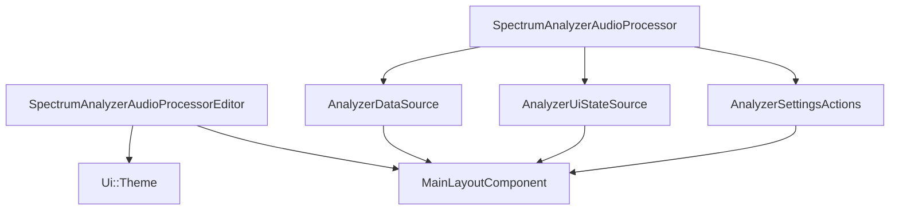
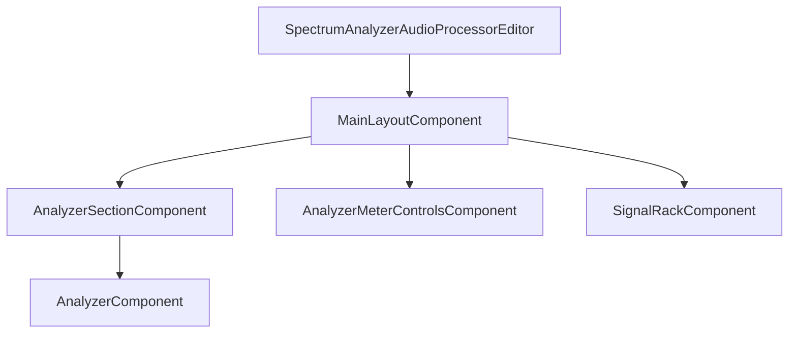
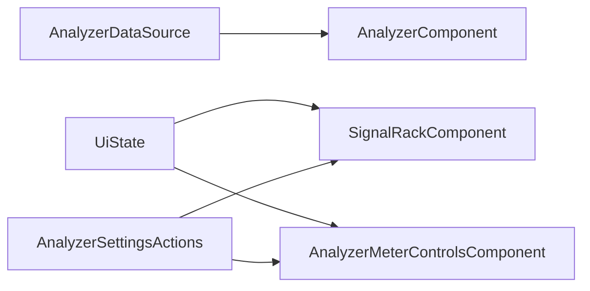
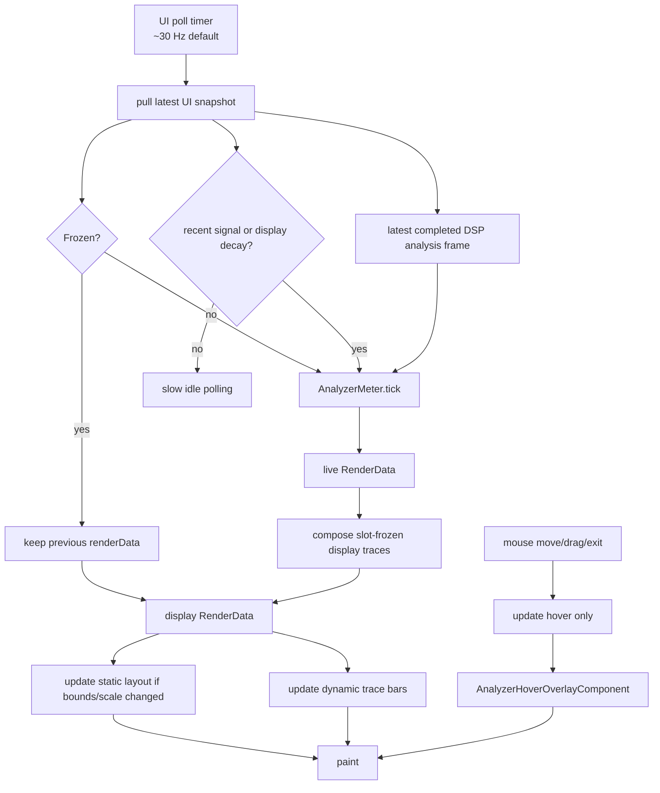
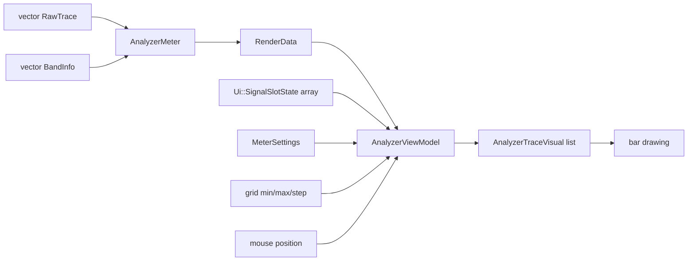
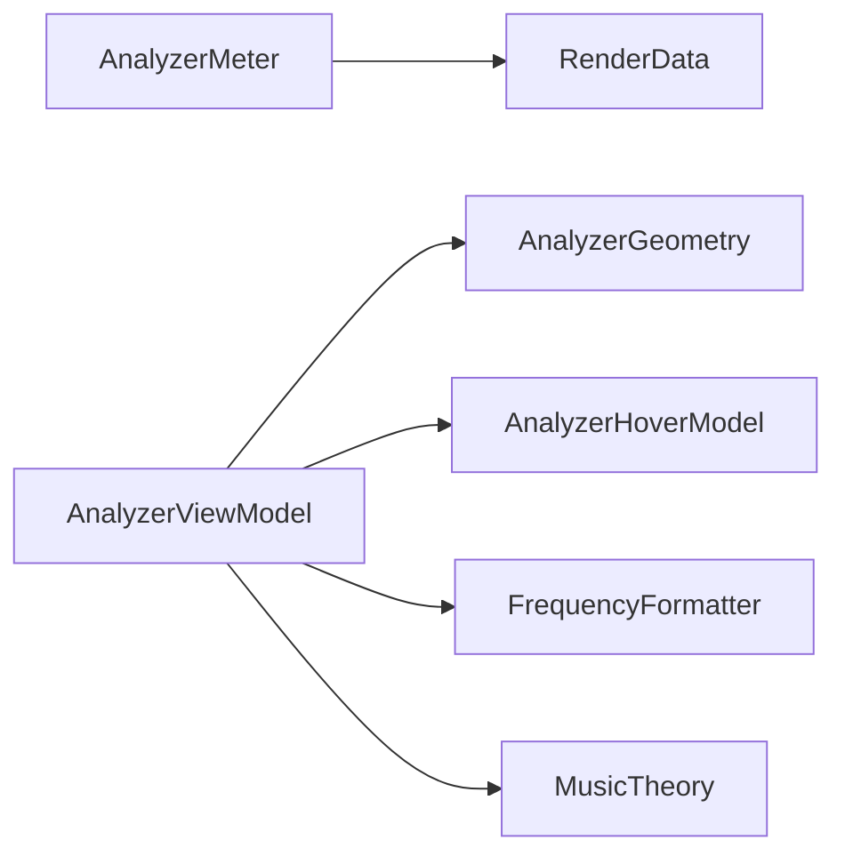
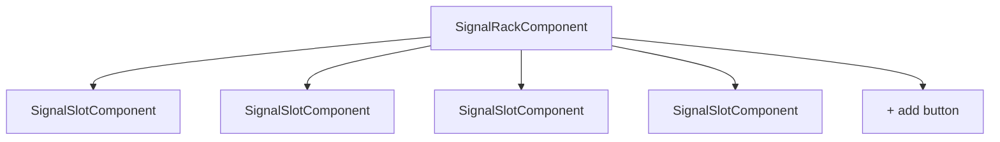
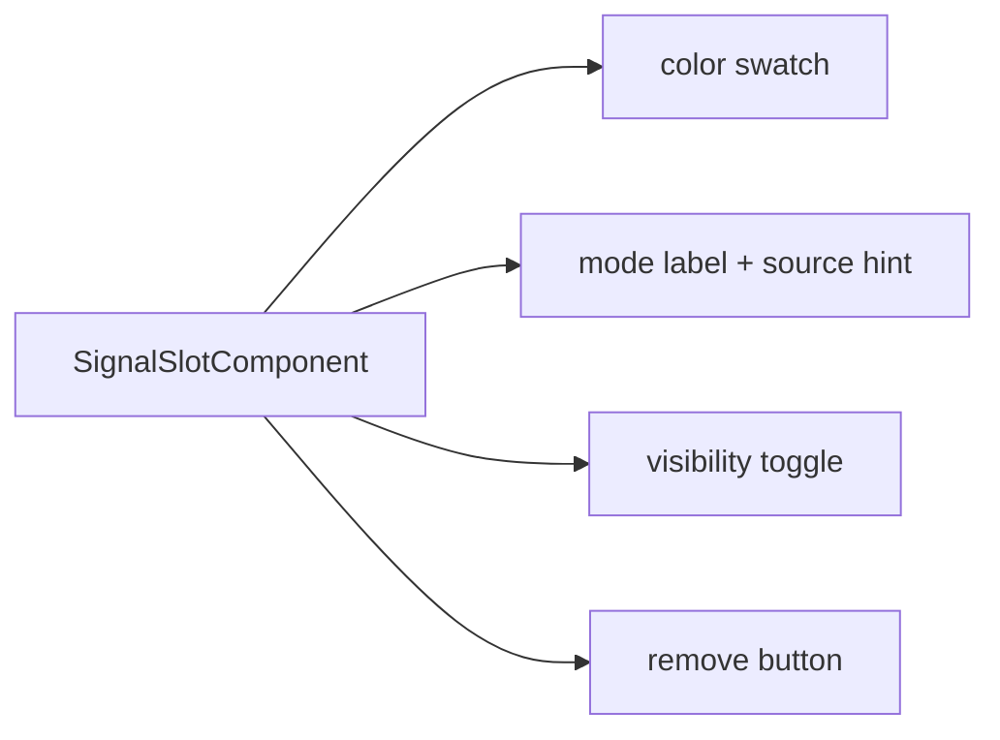
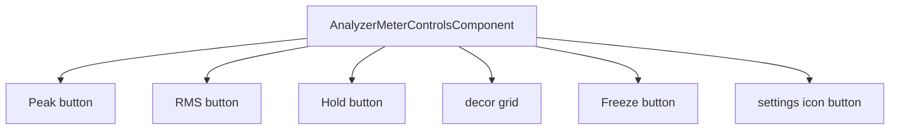
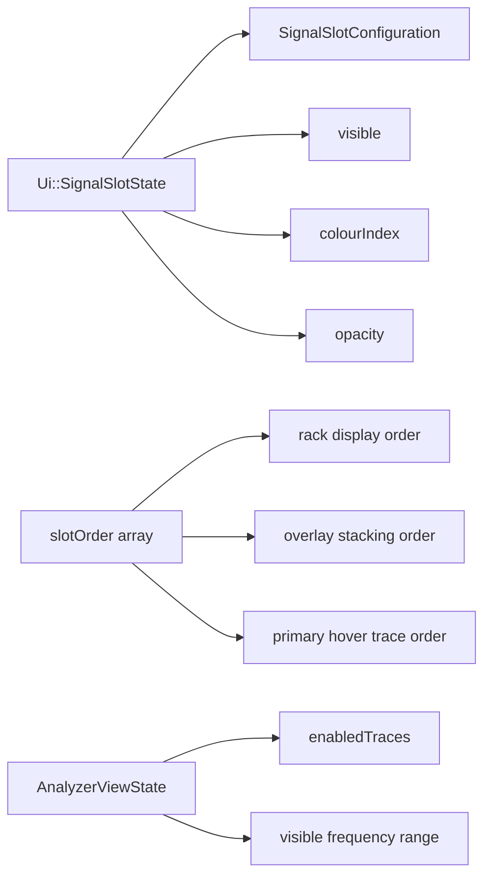

# UI Architecture

This document describes the current editor and analyzer UI architecture from `SpectrumAnalyzerAudioProcessorEditor` down into the analyzer `view/`, `model/`, `popups/`, and helper layers.

## 1. Top-Level Editor Flow

- The editor owns the theme and one `MainLayoutComponent`.
- The processor is passed into the layout three times:
  - as `AnalyzerDataSource` for read-only UI state
  - as `AnalyzerUiStateSource` for discrete UI snapshots and change notifications
  - as `AnalyzerSettingsActions` for UI-triggered parameter changes

## 2. Editor Layout

Current layout in `MainLayoutComponent`:

- main body:
  - left: analyzer section
  - right: vertical analyzer control strip
- bottom strip:
  - visible signal rack section
  - fixed four-lane rack geometry with three permanent vertical dividers

## 3. UI Responsibilities By Layer

- `AnalyzerDataSource`
  - read-only analyzer render data
- `AnalyzerUiStateSource`
  - discrete UI snapshot for freeze, meter toggles, slot state, slot order, and sidechain availability
- `AnalyzerSettingsActions`
  - write path for user actions
  - semantic slot operations such as apply, remove, and add

This split keeps UI reads and UI writes explicit.

Current analyzer folder split:

- `src/ui/analyzer/view/`
  - JUCE components
- `src/ui/analyzer/model/`
  - derived UI state, policy, and refresh logic
- `src/ui/analyzer/popups/`
  - custom callout content
- `src/ui/analyzer/helpers/`
  - low-level geometry, smoothing, hover, and formatting helpers

## 4. MainLayoutComponent

`MainLayoutComponent` is the top-level UI coordinator.

It owns:

- `AnalyzerSectionComponent`
- `SignalRackComponent`
- `AnalyzerMeterControlsComponent`

Responsibilities:

- compute the three main section bounds
- place the analyzer section, right-side control strip, and bottom signal rack
- place the major section dividers between those bounds
- keep section geometry stable even when individual sections are temporarily hidden during UI iteration

It does not do analyzer rendering itself.

## 4a. AnalyzerSectionComponent

`AnalyzerSectionComponent` is the dedicated analyzer-area container.

It owns:

- `AnalyzerComponent`

Responsibilities:

- own analyzer-section-local layout
- define where the live analyzer display lives inside the analyzer section
- cache and paint the analyzer section background/chrome
- keep section-level skinning and bounds policy out of the live analyzer renderer

It does not own analyzer data polling or trace rendering logic.

## 4b. AnalyzerMeterControlsComponent

`AnalyzerMeterControlsComponent` is the dedicated right-side analyzer control strip.

It owns:

- settings icon button
- `Peak` toggle button
- `RMS` toggle button
- `Hold` toggle button
- decorative grid element
- global freeze button

Responsibilities:

- subscribe to `AnalyzerUiStateSource`
- keep the strip controls visually in sync with analyzer UI state
- route analyzer-global meter/freeze actions into `AnalyzerSettingsActions`
- own the right-strip-only layout hierarchy:
  - utility/settings area at the top
  - meter mode group
  - decor break
  - freeze action

## 5. AnalyzerComponent Rendering Flow

`AnalyzerComponent` owns:

- latest `bandInfo`
- latest `rawTraces`
- `AnalyzerMeter`
- `RenderData`
- `AnalyzerViewModel`
- `AnalyzerViewState`
- `AnalyzerRefreshModel`
- `Ui::AnalyzerConstants`
- hover position
- `AnalyzerHoverOverlayComponent`

Responsibilities:

- poll processor-backed analyzer data
- read the latest completed DSP analysis frame from the triple buffer
- use `AnalyzerRefreshModel` for UI snapshot refresh, freeze-edge handling, and idle-polling decisions
- convert raw traces into display-rate metered values
- compose per-slot frozen traces from cached last-painted `RenderTrace` data
- rebuild cached static layout only when geometry or scale inputs change
- rebuild dynamic bar geometry from the latest render data
- update hover state independently from the static and dynamic analyzer layers
- paint the analyzer plot, bars, and grid
- delegate hover-highlight and tooltip rendering to `AnalyzerHoverOverlayComponent`

Important behavior:

- if frozen:
  - `renderData` is not advanced
  - UI presentation still updates from current slot/meter settings
- if an individual slot is frozen while global freeze is off:
  - the analyzer keeps metering live traces
  - that slot reuses its cached rendered trace until it is unfrozen
- the UI poll rate is only a display concern; DSP analysis frames are produced independently on the audio thread
- visible traces are rebuilt from current signal slot UI state on every refresh
- the analyzer plot background, frame, grid, and fixed labels are cached into a static image layer and only regenerated when needed
- the analyzer section background is owned separately by `AnalyzerSectionComponent`
- hover movement updates only the lightweight hover overlay child instead of rebuilding the analyzer static layer or bar geometry
- when the engine reports no recent signal, the analyzer keeps polling only long enough for the UI meter to decay to floor, then switches to a slower idle cadence until signal returns
- UI-facing analyzer constants such as visible frequency defaults, poll cadence, frequency scale labels, and the `20 kHz` UI-visible cap live in `src/ui/analyzer/AnalyzerUiConstants.h`, not in the DSP constants header

## 6. Analyzer Data Flow

Stages:

1. DSP publishes raw per-band measurements as `RawTrace` only when a fixed-size internal analysis frame completes
2. `AnalyzerMeter` converts those into:
   - RMS dB
   - peak dB
   - hold dB
3. `AnalyzerViewModel` converts render data into:
   - plot bounds
   - grid markers
   - frequency markers
   - per-trace bar rectangles
   - hover tooltip data

## 7. Analyzer Helper Layer

Helper roles:

- `AnalyzerRefreshModel`
  - snapshot refresh, freeze-edge handling, and polling decisions
- `AnalyzerMeter`
  - UI-rate RMS averaging plus display decay/hold logic
  - peak hold refreshes immediately on a new maximum and also refreshes its timer for near-matching peaks within a small dB tolerance
- `AnalyzerViewModel`
  - split builder for static layout, dynamic trace visuals, and hover state
- `AnalyzerGeometry`
  - coordinate transforms, stable pixel-partitioned band columns, and band hit-testing
- `AnalyzerHoverModel`
  - tooltip content and bounds
- `FrequencyFormatter`
  - scale/tooltip frequency labels
- `MusicTheory`
  - note labels for hovered frequencies

## 8. Signal Rack Architecture

`SignalRackComponent` owns:

- up to `4` `SignalSlotComponent`s
- `3` permanent `SectionDividerComponent`s
- one trailing `+` add button
- `SignalRackLayoutEngine`
- `SignalRackDragSession`

Responsibilities:

- subscribe to `AnalyzerUiStateSource`
- map enabled slots onto visible slot components
- pass down:
  - slot config/presentation
  - used colors
  - used signal configurations
  - sidechain availability
- wire slot actions into `AnalyzerSettingsActions`
- expose per-slot visibility and freeze actions directly on each slot cell
- add a new signal into the first free slot
- keep direct slot interactions visually immediate with local optimistic updates, then reconcile back to processor state
- delegate slot default-selection policy to `src/ui/analyzer/model/SignalRackModel.h`
- own the fixed rack-lane geometry used by slots, dividers, drag preview, and the add button

Current slot-cell layout:

- top row:
  - left: vertical source toggle with `Main` on top and `Sidechain` on bottom
  - right: mode picker for the currently selected source
- bottom row:
  - colour picker
  - drag handle
  - on/off visibility button
  - freeze button
  - remove button

Interaction split:

- `SignalSlotComponent`
  - owns slot background, child layout, popup launch points, and routes child interactions into the existing slot callbacks
- `SignalSlotSourceToggle`
  - owns the inline `Main / Sidechain` source control
- `SignalSlotModeButton`
  - owns the mode-picker button surface
- `SignalSlotSwatchButton`
  - owns colour display plus opacity drag/reset interaction
- `SignalSlotDragHandle`
  - owns drag-handle painting and reorder gesture tracking
- `SignalSlotActionButton`
  - shared small action-button primitive used for visibility, freeze, and remove
- `SignalSelectionPopupContent`
  - now presents only mode choices for the slot's current source
- `SignalRackComponent`
  - still owns optimistic state updates and routes semantic source/mode/visibility/freeze/remove actions to `AnalyzerSettingsActions`

Reordering responsibilities are split out:

- `SignalRackLayoutEngine`
  - deterministic four-lane rack partitioning
  - permanent divider bounds between lanes
  - visible slot bounds mapped onto the first active lanes
  - active rack span used by drag/reorder
- `SignalRackDragSession`
  - drag session state
  - floating dragged-cell bounds
  - preview-order calculation and final commit order
- `SignalSlotOrderModel`
  - ordered-slot and trace-order helper logic
- `SignalRackModel`
  - pure helpers for choosing a free slot, default signal option, default colour, and append-to-end order

Current behavior:

- disabled slots are not shown
- hidden slots stay in the rack but render as `Off`
- add button is visible only while active slot count is below `Shared::maxSignalSlots`
- add button occupies the next free fixed lane
- the three rack dividers stay visible even when not all lanes are occupied
- drag-reordering changes only UI order, not DSP slot identity
- the dragged slot is painted as a floating overlay while the real child component stays anchored
- the `+` add cell uses the same lane system as normal slots

## 9. Signal Slot Component

Each `SignalSlotComponent` shows:

- a textured module face using `background_2_version.png`
- a rounded module border and drag shadow
- slot controls are currently hidden while the rack shell/material design is being rebuilt

Supported interactions:

- the interaction plumbing for source, mode, colour, opacity, reorder, visibility, freeze, and remove is still present in `SignalSlotComponent`
- the child controls are currently hidden from the live UI while the rack shell/material design is being rebuilt

Responsibility split:

- `SignalSlotComponent`
  - slot painting
  - hit-testing
  - opacity drag
  - reorder drag gesture forwarding
  - callout lifecycle
- `SignalSelectionPopupContent`
  - signal-option callout rows and section layout
- `SignalColourPopupContent`
  - colour grid callout layout
- `SignalSlotOptions`
  - single source of truth for supported source/mode combinations and labels

Picker rules:

- duplicate source/mode combinations are disabled
- duplicate preset colors are disabled
- slot picker options are driven from `src/ui/analyzer/model/SignalSlotOptions.h`
- source selection lives inline in the slot cell via the `Main / Sidechain` toggle
- the signal picker callout now shows only `Mid / Side / Stereo` for the slot's currently selected source
- both signal and color pickers are custom `CallOutBox` content, not `PopupMenu`
- clicking the same opener again dismisses the currently open callout

## 10. Meter Controls Component

Responsibilities:

- subscribe to `AnalyzerUiStateSource`
- keep the strip controls visually synced
- send meter/freeze toggles through `AnalyzerSettingsActions`

Current styling:

- small raster pad buttons for `Peak`, `RMS`, and `Hold`
- larger raster freeze pad with icon treatment
- icon-only settings control with a small top utility divider
- decorative raster grid element between the meter group and freeze action
- warm analog marking colors come from the shared theme rather than per-trace colours

## 11. UI State Types

Important UI-facing state types:

- `Ui::SignalSlotState`
  - one slot’s render and interaction state
- `Ui::AnalyzerUiState`
  - immutable editor snapshot for discrete controls and rack state
- `std::array<size_t, Shared::maxSignalSlots>`
  - persistent UI slot order
- `AnalyzerViewState`
  - currently visible traces and optional frequency-range override
- `Analyzer::RenderData`
  - render-ready meter output

The processor owns `plugin/state/SignalSlotOrderState`, which persists the slot order and exposes it through `AnalyzerDataSource`.
The engine does not use this order.

Important order/detail notes:

- rack order is left-to-right by `slotOrder`
- hover priority follows that same order
- paint order follows rack order, so the rightmost/later cell is drawn last and appears on top
- `AnalyzerUiState` is published from the processor on the message thread via `AnalyzerUiStateSource`

## 12. Theme Layer

`Ui::Theme` centralizes colors for:

- editor background
- analyzer background and plot surface
- controls
- grid and axis
- tooltip
- accent buttons

Signal overlays do not come from the main theme accent.
They come from the preset signal palette:

- `Ui::getSignalPresetColour(int)`
- `Ui::getSignalPresetName(int)`
- both read from the shared preset catalog used by UI and parameter metadata

Each visible trace uses:

- preset color
- slot opacity

## 13. Current Limitations

- Hover currently uses the leftmost visible trace as its data source.
- `AnalyzerComponent` still uses a timer, intentionally, because analyzer render data is continuous and display-rate driven.
- Slot reordering is UI-only and currently stored through plugin state serialization, not APVTS parameters.

## Guiding Rule

The UI is split into:

- read-only data access through `AnalyzerDataSource`
- write actions through `AnalyzerSettingsActions`
- display-rate analyzer rendering in `AnalyzerComponent`
- signal configuration UI in `SignalRackComponent` and `SignalSlotComponent`
- slot-option and default-selection policy in `src/ui/analyzer/model/`
- refresh/state-transition logic in `src/ui/analyzer/model/AnalyzerRefreshModel.*`
- custom callout content in `src/ui/analyzer/popups/`

The processor remains the bridge between APVTS-backed state and the editor.
Inside the plugin layer, typed parameter reads and writes now go through `plugin/parameters/ParameterAccess`, backed by the single parameter-definition source in `plugin/parameters/ParameterSchema`.
The analyzer helpers keep rendering logic out of the top-level components.
