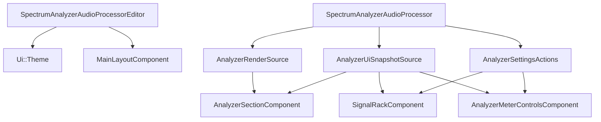
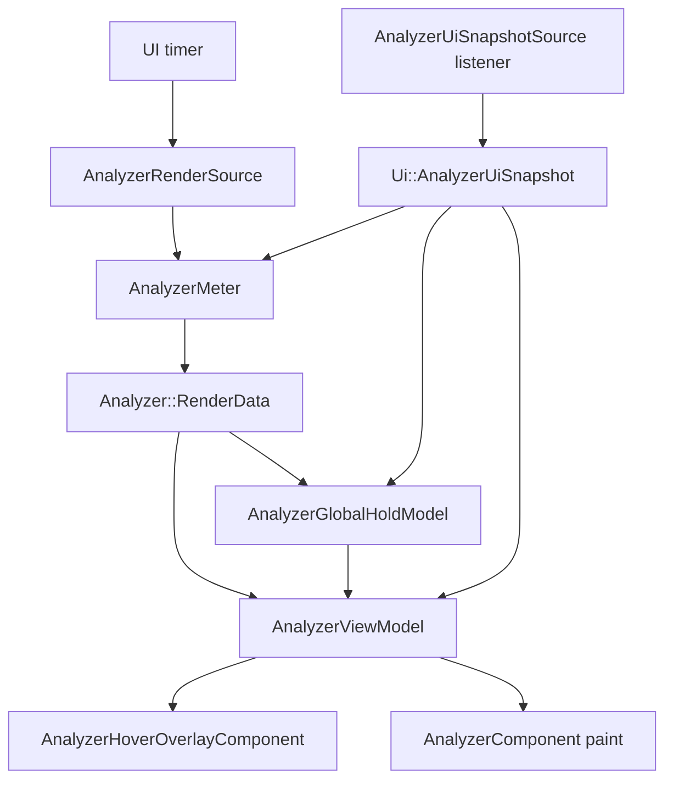

# UI Architecture

This document describes the current UI architecture after the analyzer state split into:

- a high-frequency render channel
- a low-frequency immutable UI snapshot channel
- a write-only action channel

## Top-Level Flow

- The processor is the composition root.
- The editor owns the theme and top-level layout only.
- Read responsibilities are split:
  - `AnalyzerRenderSource` for analyzer traces, band metadata, and recent-signal activity
  - `AnalyzerUiSnapshotSource` for immutable UI/control state
- Writes go through `AnalyzerSettingsActions` only.

## Channel Split

### 1. Render Channel

`AnalyzerRenderSource` owns:

- `getBandInfo()`
- `getRawTraces()`
- `hasRecentSignal()`

Rules:

- this is the high-frequency analyzer render path
- it stays pull-based
- it stays separate from UI snapshot publication
- the triple buffer remains the transport for raw traces from DSP to UI

### 2. UI Snapshot Channel

`AnalyzerUiSnapshotSource` owns:

- `getAnalyzerUiSnapshot()`
- snapshot listener registration

`Ui::AnalyzerUiSnapshot` is the single source of truth for low-frequency analyzer UI state:

- `signalSlots`
- `slotOrder`
- `meterSettings`
- `frozen`
- `sidechainAvailable`
- `gridMinDb`
- `gridMaxDb`
- `gridStepDb`

Rules:

- views render from this snapshot
- views do not keep competing writable copies of this state
- derived state is computed from selectors, not stored independently

### 3. Action Channel

`AnalyzerSettingsActions` is the only UI write path.

Rules:

- views dispatch intents only
- views do not know parameter ids
- the processor owns the bridge from intents to APVTS/state updates

## Folder Responsibilities

### `src/plugin/`

- composition root
- owns APVTS, serialization, and listener wiring
- publishes render data and UI snapshots
- consumes UI intents

### `src/ui/`

- shared UI primitives only
- shared theme tokens
- shared popup shell
- shared popup chrome helpers
- shared icons and shared assets
- no analyzer-specific policy

### `src/ui/analyzer/model/`

- `AnalyzerUiSnapshot`
- snapshot selectors
- option metadata
- global hold overlay logic
- refresh cadence decisions
- axis/frequency policy
- meter tuning
- view-model derivation

### `src/ui/analyzer/view/`

- JUCE `Component` classes only
- render from `Ui::Theme`, `AnalyzerUiSnapshot`, and analyzer render data
- dispatch intents through `AnalyzerSettingsActions`
- no APVTS access
- no duplicated business state

### `src/ui/analyzer/popups/`

- popup content components only
- consume centralized popup tokens, popup chrome helpers, and signal metadata

### `src/ui/analyzer/helpers/`

- low-level math, geometry, formatting, and render utilities only
- no ownership of product state or duplicated UI policy

## Theme And Config Ownership

`Ui::Theme` now owns shared UI tokens plus named analyzer presentation tokens.

Important groups:

- `metrics.editor`
  - initial editor size
- `metrics.popup`
  - popup shell, row, and swatch styling
- `metrics.analyzerPlot`
  - plot margins, frame styling, axis label geometry, frequency-scale policy
- `metrics.tooltip`
  - tooltip size, offsets, padding, font, and chrome styling
- `metrics.slot`
  - slot/button/source-toggle interaction metrics
- `metrics.sectionDivider`
  - divider thickness and gradient stops

Rule:

- if a UI literal affects appearance, geometry, or repeated interaction behavior, it belongs in owned config/theme, not in a view file

## Analyzer Rendering Flow

Important behavior:

- the analyzer plot reads traces and band metadata from the render source
- the analyzer plot reads visibility, freeze, grid, and meter settings from the immutable snapshot
- slot-frozen display traces are a UI concern layered on top of live render data
- one global hold overlay is derived after display composition from the traces that are currently drawn
- owner tint for that hold overlay is latched in analyzer model logic, not DSP or snapshot state
- idle polling remains a display concern only

## Signal Metadata

`SignalSlotOptions.h` is the source of truth for:

- mode labels
- source labels
- source hints
- option availability
- default slot selection order
- visible option counts used by popup layout

Rule:

- renaming or adding signal modes/sources must be done in the metadata table, not in views

## Derived State Rules

Derived state must be computed, not stored as a parallel mutable model.

Examples:

- visible trace kinds are derived from `signalSlots`
- popup row counts are derived from signal metadata
- slot ordering for drawing is derived from `slotOrder` plus selectors
- global hold is derived from the display-composed traces, not stored in the snapshot or DSP transport

## Triple Buffer Boundary

The triple buffer is intentionally unchanged.

- DSP publishes raw traces through the engine’s triple buffer
- UI pulls the latest published raw traces through `AnalyzerRenderSource`
- `Ui::AnalyzerUiSnapshot` does not carry trace payloads

This keeps the lock-free render transport separate from low-frequency UI state publication.
