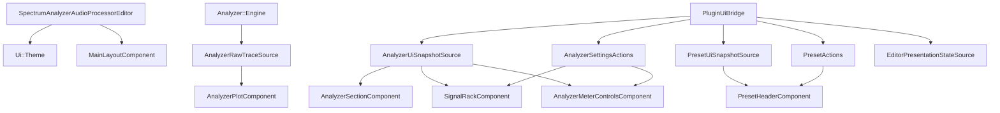

# UI Architecture

The UI layer is message-thread presentation and interaction code. It owns UI-facing state types, UI contracts, layout, painting, popups, and transient interaction state. It does not own APVTS, preset persistence, DSP computation, or worker-thread display evolution.

## Standard Feature Shape

Every UI feature should follow the same shape. Small features may omit folders that would be empty, but responsibilities should remain distinct.

- `state/`
  - immutable UI snapshots, descriptors, action results, and view-state structs
  - no APVTS, filesystem, preset document XML, or plugin persistence types
- `contracts/`
  - read-only snapshot sources and write-only action interfaces
  - contracts use UI/shared types only
- `model/` or `logic/`
  - pure selectors, option derivation, formatting, availability rules, layout math, and paint-batch preparation
  - no component ownership or async popup lifetime management
- `interaction/`
  - transient interaction state machines such as drag sessions, keyboard selection, and preview ordering
- `view/`
  - JUCE `Component` classes
  - consume snapshots, render state, and dispatch intents through contracts
- `popups/`
  - popup content components
  - use shared popup/callout helpers instead of duplicating callout lifetime policy

The preset feature is the reference for cross-layer UI state:

- UI-facing preset state lives in `src/ui/presets/state/PresetUiState.h`.
- UI preset contracts live in `src/ui/presets/contracts/`.
- UI preset view components live in `src/ui/presets/view/`.
- UI preset popup content lives in `src/ui/presets/popups/`.
- UI preset formatting/model helpers live in `src/ui/presets/model/`.
- Plugin preset documents, stores, serializers, and APVTS snapshots stay in `src/plugin/presets/`.
- The plugin maps plugin-domain preset data into `Ui::Presets` snapshots/results before publishing to UI.

## Top-Level Flow

The editor receives all contracts through one `Ui::EditorContext` struct assembled by the plugin composition root: the raw trace channel resolves to `Analyzer::Engine`, everything else to `PluginUiBridge`.

The editor owns the theme and top-level layout. `MainLayoutComponent` lives under `src/ui/editor/layout/` and owns product/header composition, analyzer section placement, rack placement, and control strip placement.

`AnalyzerSectionComponent` is analyzer-only:

- static analyzer shell
- analyzer plot layout
- axis labels
- tooltip presentation
- plot child bounds

It does not own preset UI, popup actions, worker state, or hot-path plot batching.

## Read / Write Channels

### Analyzer Raw Trace Channel

`AnalyzerRawTraceSource` is the high-frequency DSP-to-display read contract:

- `getBandInfo()`
- `readPublishedTraces()`
- `hasRecentSignal()`
- `shouldProcessAnalyzer()`

This is raw measurement transport, not UI state. The display worker is the primary consumer.

### Display Frame Channel

The display worker publishes immutable analyzer display frames to the plot:

- producer: `AnalyzerDisplayWorker`
- transport: `AnalyzerDisplayFrameBuffer` / `TripleBuffer<AnalyzerDisplayFrame>`
- consumer: `AnalyzerPlotComponent`

Frames are semantic display state keyed by slot index. They do not contain slot order, colours, hover state, or JUCE component geometry.

### UI Snapshot Channels

Low-frequency UI state is published through immutable snapshots:

- analyzer: `AnalyzerUiSnapshotSource` -> `Ui::AnalyzerUiSnapshot`
- presets: `PresetUiSnapshotSource` -> `Ui::Presets::PresetUiSnapshot`
- editor presentation: `EditorPresentationStateSource` -> `Ui::EditorPresentationState`

Contracts live with the feature they describe:

- analyzer contracts: `src/ui/analyzer/contracts/`
- preset contracts: `src/ui/presets/contracts/`
- editor contracts: `src/ui/editor/contracts/`

Snapshots must not carry raw trace payloads, APVTS handles, or plugin persistence documents.

### Action Channels

Views dispatch intents only:

- analyzer actions: `AnalyzerSettingsActions`
- editor presentation actions: `EditorPresentationActions`
- preset actions: `PresetActions`

Views must not know parameter ids, APVTS details, preset file paths, XML format, or plugin serialization policy.

## Optimistic Local Echo

Direct controls may update their own local visual state immediately after user input. This is intentional: the UI should feel instant, then reconcile with the next authoritative snapshot.

Rules:

- local echo is temporary component-local presentation state
- the next snapshot from the source is authoritative
- local echo must not become a second writable domain model
- local echo should stay near direct input handling, not in shared state structs

Examples:

- rack slot buttons may flip their active visual state immediately
- colour/mode popups may update the visible slot control immediately
- preset popups may remove a row after a successful delete action

The plugin still owns persistence and parameter writes. The UI echo only bridges the time before the next snapshot publication.

## Paired Settings Controls

The settings page derives narrower interactive ranges for related controls where unrestricted direct manipulation would create an awkward display. Grid minimum/maximum keep at least 6 dB of separation, and visible frequency minimum/maximum keep at least a 2:1 ratio when edited in the plugin UI.

These are settings-page interaction limits, not global parameter invariants. `PluginUiBridge` applies them to UI intents, while host automation and restored state may address the APVTS parameters independently. Published snapshots reflect the stored values and do not repair a host-authored combination by changing another parameter.

## Analyzer Feature

`src/ui/analyzer/plot/view/`

- JUCE analyzer section and plot components
- section owns shell, labels, tooltip, and plot child placement
- plot owns worker-frame consumption, hot plot repainting, and hover highlight

`src/ui/analyzer/plot/state/`

- plot UI constants, section layout structs, and plot view state
- no JUCE components and no worker-owned display evolution

`src/ui/analyzer/plot/logic/`

- message-thread layout, geometry, hover lookup, formatting, and paint batching
- no meter decay, hold evolution, or refresh-cadence state machines

`src/ui/analyzer/rack/`

- rack `state/` owns slot UI state
- rack `model/` derives slot defaults and options
- rack `interaction/` owns reorder drag state and layout preview
- rack `view/` owns JUCE slot/rack components
- rack `popups/` owns colour and mode popup content

`src/ui/analyzer/controls/view/`

- analyzer control strip components
- snapshot-driven and action-dispatching

## Popup Ownership

Popup content belongs to feature folders. Callout lifetime policy belongs to shared UI helpers.

Use `Ui::CalloutPresenter` for:

- launch/dismiss
- look-and-feel assignment/removal
- active callout tracking
- async callout cleanup

Popup content reports intent through callbacks. It must not find or dismiss its parent `juce::CallOutBox` directly. Feature components may still keep feature-specific popup state such as which menu is open or which trigger should regain focus.

## Theme Ownership

`Ui::Theme` owns visual tokens and repeated interaction metrics.

If a literal affects appearance, geometry, or repeated interaction behavior, it belongs in theme/config rather than a view file.

## Source Of Truth

- plugin owns APVTS, persistence, and cross-layer wiring
- display owns worker-thread analyzer display state
- UI owns presentation state, interaction state, and component layout
- `shared` may define cross-layer value types/defaults, but must not include `src/ui`
- snapshots are the authoritative UI state from plugin to UI
- direct local echo is temporary and must reconcile with snapshots
