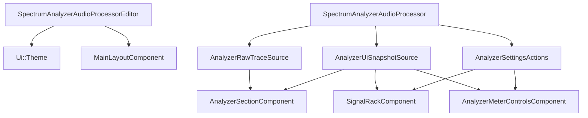
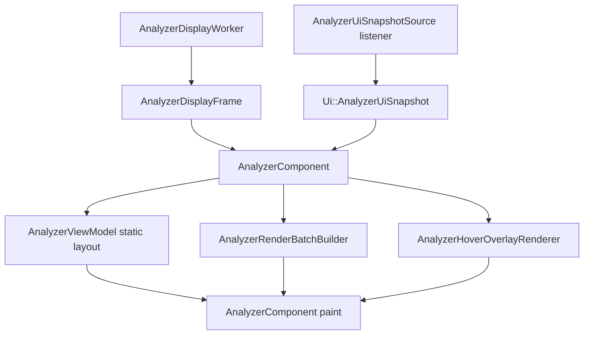

# UI Architecture

This document describes the current UI architecture after the analyzer split into:

- a DSP raw-trace channel
- a worker-thread display channel
- a low-frequency immutable UI snapshot channel
- a write-only action channel

## Top-Level Flow

The editor still owns:

- theme
- top-level layout

The processor still owns:

- contracts
- snapshot publication
- action handling

The analyzer plot now owns a display worker internally and no longer runs analyzer semantics on the message thread.

## Read / Write Channels

### 1. Raw Trace Channel

`AnalyzerRawTraceSource` owns:

- `getBandInfo()`
- `readPublishedTraces()`
- `hasRecentSignal()`

Rules:

- this is not a UI snapshot channel
- this is not paint-ready data
- the message thread should not consume raw traces directly
- this contract primarily feeds the display worker

### 2. Display Frame Channel

This channel is internal to the analyzer section:

- producer: `AnalyzerDisplayWorker`
- consumer: `AnalyzerComponent`

Transport:

- `AnalyzerDisplayFrameBuffer`
- `TripleBuffer<AnalyzerDisplayFrame>`

Rules:

- published frames are immutable
- frames are semantic display state, not JUCE geometry
- frames are keyed by slot index, not visual order

### 3. UI Snapshot Channel

`AnalyzerUiSnapshotSource` owns:

- `getAnalyzerUiSnapshot()`
- snapshot listener registration

`Ui::AnalyzerUiSnapshot` remains the only low-frequency analyzer UI snapshot type.

It contains:

- `signalSlots`
- `slotOrder`
- `meterSettings`
- `frozen`
- `sidechainAvailable`
- `gridMinDb`
- `gridMaxDb`
- `gridStepDb`

### 4. Action Channel

`AnalyzerSettingsActions` is still the only UI write path.

Rules:

- views dispatch intents only
- views must not know parameter ids
- views must not talk to APVTS directly

## Folder Responsibilities

### `src/ui/`

- shared UI primitives
- theme tokens
- popup chrome
- icons and assets
- no analyzer-specific worker logic

### `src/ui/analyzer/controls/`

- analyzer control strip components only
- snapshot-driven
- action-dispatching

### `src/ui/analyzer/layout/`

- top-level analyzer area composition only

### `src/ui/analyzer/plot/view/`

- JUCE `Component` classes only
- analyzer section container
- analyzer plot component
- hover overlay

### `src/ui/analyzer/plot/logic/`

Now message-thread-only and presentation-only:

- `AnalyzerViewModel`
  - static layout
  - visible band layout
  - grid lines
  - frequency markers
  - hover lookup
- `AnalyzerRenderBatchBuilder`
  - direct paint-batch generation from immutable display frames
- `AnalyzerGeometry`
  - domain-to-screen mapping
- formatting and hover helpers

This folder no longer owns:

- meter decay
- display composition
- global hold evolution
- refresh cadence

Those moved to `src/display/analyzer/`.

### `src/ui/analyzer/rack/`

- rack interaction
- rack layout
- rack popups
- slot controls and slot visuals

### `src/ui/analyzer/state/`

- immutable analyzer UI snapshot types only

## Analyzer Plot Flow

Important behavior:

- `AnalyzerComponent` no longer runs meter/composition/hold logic
- it consumes immutable display frames from the worker
- it consumes immutable snapshot state from the processor
- it rebuilds static layout only when layout inputs change
- it rebuilds dynamic paint batches from:
  - `AnalyzerDisplayFrame`
  - visible bands
  - slot order
  - slot styling
  - current grid range

## `AnalyzerComponent` Responsibilities

`AnalyzerComponent` now owns:

- `AnalyzerDisplayWorker`
- latest consumed display frame pointer
- static layout invalidation
- dynamic batch rebuilds
- repaint decisions
- hover updates

It does not own:

- `AnalyzerMeter`
- display composition
- hold evolution
- refresh cadence state machine
- copied raw trace vectors

That is the key reason the hot path is smaller on the message thread.

## Presentation vs Semantic State

This split is the most important UI rule in the current design.

### Semantic state

Semantic state affects time-evolving display behavior and is submitted to the worker through `AnalyzerDisplayControlState`.

Examples:

- global freeze
- per-slot freeze
- hold visibility/settings
- contribution mask derived from slot visibility
- floor dB

### Presentation state

Presentation state stays on the message thread and must not wake the worker.

Examples:

- slot order
- colour
- opacity
- hover
- zoom / visible frequency range

Practical consequence:

- opacity drag is UI-only
- reorder drag is UI-only
- freeze and hold still go through the worker

## Static Layout vs Dynamic Batching

The plot code is now split into two presentation stages.

### Static layout

Owned by `AnalyzerViewModel`.

Inputs:

- band layout
- component bounds
- grid min/max/step
- visible frequency range

Outputs:

- plot bounds
- visible bands
- grid markers
- frequency markers

### Dynamic batching

Owned by `AnalyzerRenderBatchBuilder`.

Inputs:

- latest `AnalyzerDisplayFrame`
- visible bands
- slot order
- slot colour / opacity
- meter visibility
- plot bounds

Outputs:

- rectangle batches for bars
- rectangle batches for hold
- rectangle batches for hover highlight

This removes the old extra pass that built full intermediate trace/bar models every frame.

## Hover Overlay

`AnalyzerHoverOverlayRenderer` remains a lightweight helper owned by `AnalyzerComponent`.

It owns:

- hover-only repaint bounds
- hovered-bar highlight batches
- tooltip chrome and glyphs

It consumes:

- hover info from `AnalyzerViewModel`
- immutable display frame
- visible bands
- slot styling/order

It does not own analyzer semantics.

## Theme Ownership

`Ui::Theme` remains the owner of visual tokens and repeated interaction metrics.

Important groups:

- `metrics.editor`
- `metrics.popup`
- `metrics.analyzerPlot`
- `metrics.tooltip`
- `metrics.slot`
- `metrics.sectionDivider`

Rule:

- if a literal affects appearance, geometry, or repeated interaction behavior, it belongs in theme/config, not in a view file

## Triple Buffer Boundary

The UI now consumes the second triple-buffer boundary, not the first one.

- DSP triple buffer
  - raw traces
  - reader: display worker
- display triple buffer
  - display frames
  - reader: message thread

UI snapshots remain separate from both.

## Current State

- analyzer plot is no longer timer-driven for semantic recomputation
- worker thread owns display-rate analyzer state
- message thread owns only presentation state
- slot order, colour, and opacity are UI-only concerns
- hold and freeze semantics are worker-owned concerns
- analyzer docs and code now align on the explicit `dsp / display / ui` split
